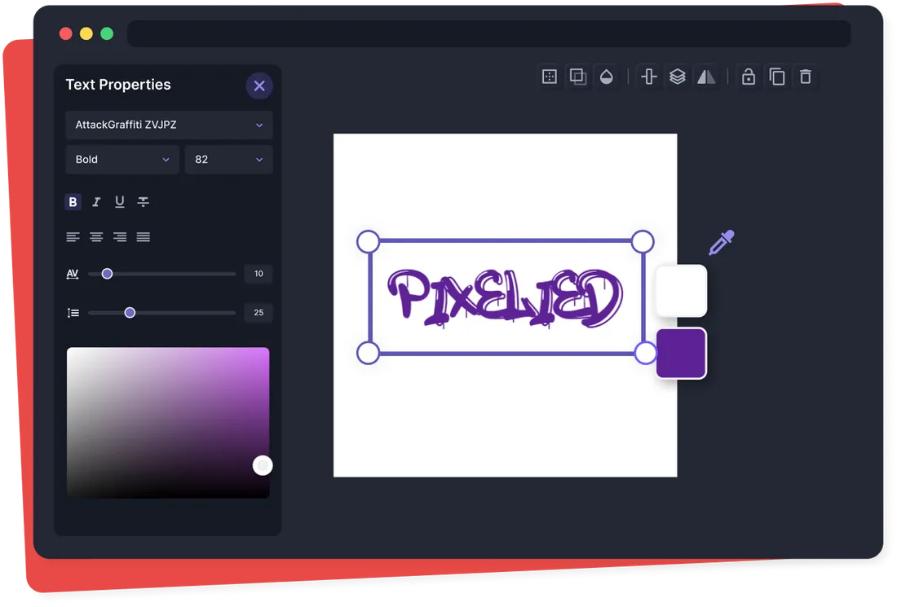
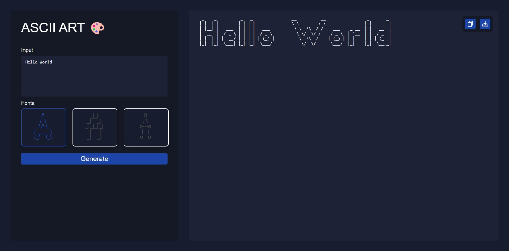
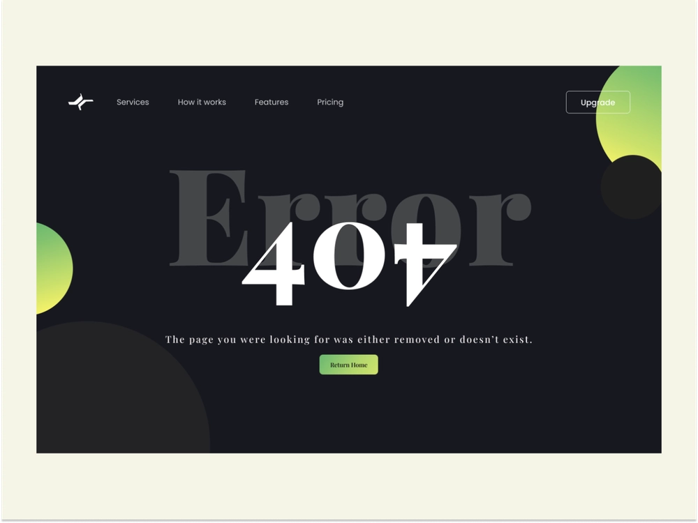
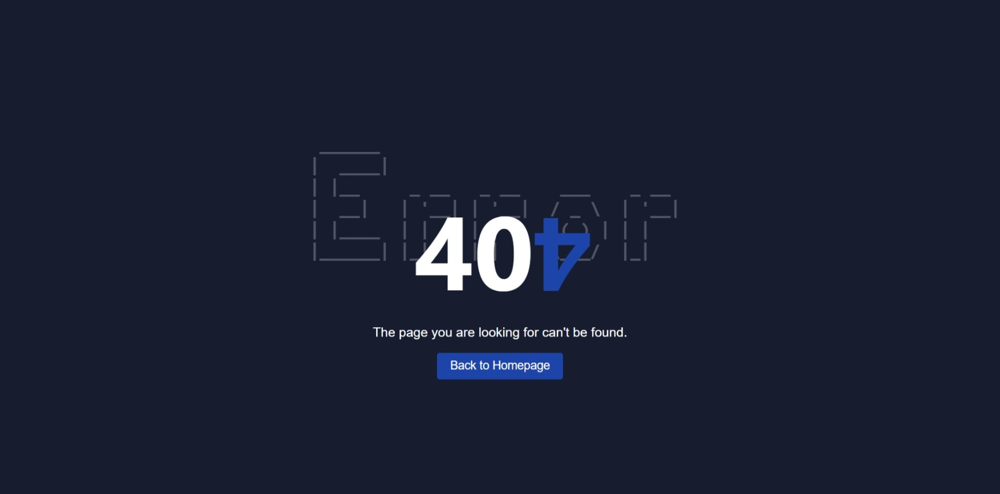

#   🌐 ASCII ART WEB
##  DESCRIPTION
ASCII-art-web consists in creating and running a server, in which it will be possible to use a web GUI (graphical user interface) version of your last project, ASCII-art.

```
 _    _          _   _                __          __                 _       _  
| |  | |        | | | |               \ \        / /                | |     | | 
| |__| |   ___  | | | |   ___          \ \  /\  / /    ___    _ __  | |   __| | 
|  __  |  / _ \ | | | |  / _ \          \ \/  \/ /    / _ \  | '__| | |  / _` | 
| |  | | |  __/ | | | | | (_) |          \  /\  /    | (_) | | |    | | | (_| | 
|_|  |_|  \___| |_| |_|  \___/            \/  \/      \___/  |_|    |_|  \__,_| 
```

##  AUTHORS
+   Serigne Saliou Mbacké Mbaye
+   Moustapha Ndiaye
+   Magatte Niang

##  USAGE: HOW TO RUN
1. Open a terminal a type the following command:
```
go run .
```
2. Go to the following URL in your browser
http://localhost:8080

##  UI DESIGN
|Inspirations|Implementation|
|-|-|
| | |
| | |